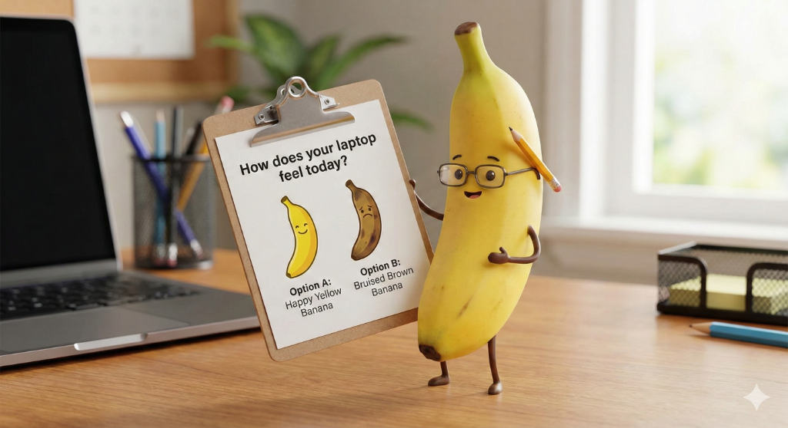

Picture this scenario. It is Monday morning. You are in a meeting with the CIO.

"How is the environment running?" they ask.

You pull up your dashboards. Intune says all devices are compliant. ServiceNow says tickets are within SLA. The network monitoring tool shows 99.9% uptime. You smile and say, "Everything is green. We are looking great."

Meanwhile, three floors down, a Senior Accountant is staring at a spinning blue wheel. Outlook has been trying to open for 15 minutes. They can't access the file they need to close the month. They aren't filing a ticket because "IT never fixes it anyway," so they are just sitting there, frustrated and disengaged.

This is what we call the Watermelon Effect: Green on the outside (your metrics), but Red on the inside (the actual user experience).

In a truly modern workplace, a metric that looks perfect on the outside but represents a broken experience on the inside isn't a success. It is a disappointment. And in 2026, far too many of our endpoints are watermelons.

## Defining DEX: Protecting the "Flow"

This brings us to Digital Employee Experience (DEX).

DEX isn't just a buzzword for "uptime." It is the sum of every interaction a human has with your technology. It is the boot speed. It is the login prompt. It is the number of clicks it takes to find a document.

In 2026, our job isn't just to keep the lights on. Our job is to protect the user's Flow State.

Every time a laptop freezes, every time a password prompt pops up unnecessarily, and every time an update forces a reboot during a presentation, we are breaking that flow. These are "micro-aggressions" against productivity. They might not show up on a server log, but they add up to a workspace that feels sluggish and hostile.

We need to shift our mindset from SLAs (Service Level Agreements), which measure machine availability, to XLAs (Experience Level Agreements), which measure human success.

## The Human Sensor: Why Telemetry Isn't Enough

We love our "Cloud Magic" tools. We love the data we get from Azure and AWS. But hard telemetry has a blind spot.

A boot time of 45 seconds might look "Acceptable" in an Endpoint Analytics report. But to a sales rep trying to pull up pricing while a client watches, those 45 seconds feel like an eternity.

This is why we need to activate the Human Sensor.

In modern tools like Intune, we have the ability to push short, non-intrusive sentiment surveys. We need to stop asking, "Is IT doing a good job?" and start asking, "Does your technology enable you to be productive today?"

When you correlate the "feelings" (Sentiment) with the "facts" (Telemetry), the real picture emerges. You might find that your "healthiest" devices are actually the most hated because of an aggressive security policy that slows them down.

## Intune Advanced Analytics: Finding the Needle

So, how do we fix this? We use the tools to find the friction.

Intune Advanced Analytics is the flashlight in the dark room. It allows us to move beyond averages and look for Anomalies.

**Timeline Analysis:** Did boot times spike across the Marketing department specifically after last Tuesday's patch?

**Model Performance:** Is that specific model of laptop crashing 3x more often than the rest of the fleet?

**Battery Health:** Are we asking mobile workers to run a marathon on a 40% battery capacity?

By using these insights, we stop guessing. We stop applying blanket fixes. We find the specific driver, the specific app, or the specific policy that is causing the pain, and we surgically remove it.

## This Week's Challenge: Find the Friction

The goal of the Modern Workplace isn't just to be secure. It is to be invisible.

My challenge to you this week is simple. Don't look at your "Green" dashboard. Go find one source of friction for your users and kill it.

Maybe it is removing the "Accept Terms" splash screen that everyone ignores anyway.

Maybe it is fixing that one audio driver that requires a reboot before Teams calls.

Maybe it is automating a mapped drive that always disconnects.

When we fix the small things, the "Cloud Magic" actually feels magical. And work starts to feel a little more human.

Thanks for reading. See you next week.
