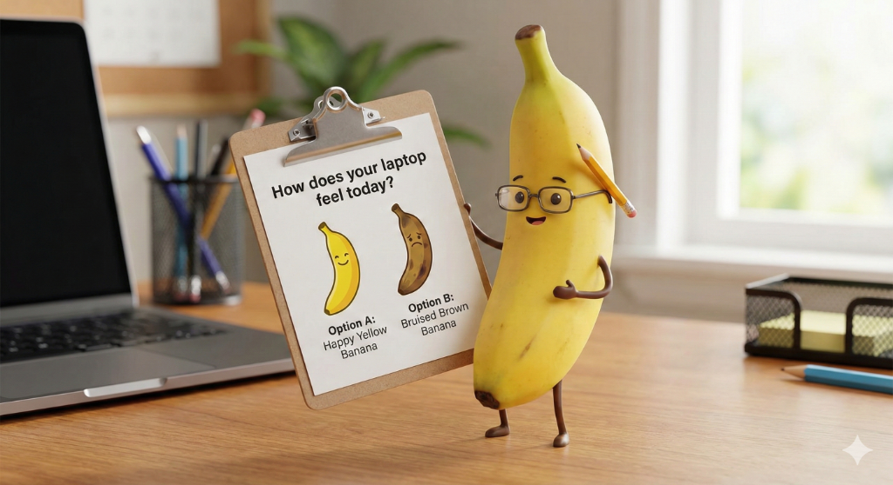

Picture a Monday morning meeting with the CIO.

"How is the environment running?" they ask.

You open your dashboards. Intune says every device is compliant. ServiceNow says tickets are inside SLA. Network monitoring shows 99.9% uptime. You say, "Everything's green."

Three floors down, a senior accountant is watching a spinning blue wheel. Outlook has been trying to open for fifteen minutes and she can't reach the file she needs to close the month. She hasn't raised a ticket, because in her experience IT never fixes it anyway. She's just sitting there, and getting more fed up by the minute.

That's the Watermelon Effect. The metrics are green on the outside and the experience is red on the inside. Plenty of our endpoints are watermelons.

## What DEX actually covers

Digital Employee Experience (DEX) is the sum of every interaction someone has with the technology they work on. Boot time. The login prompt. How many clicks it takes to find a document. Whether the laptop freezes when they plug in a second monitor.

Each of those costs a little attention. A password prompt that didn't need to appear, an update that forces a restart during a presentation, a freeze before a client call. None of them shows up as an outage in a server log, but together they make a workplace feel slow and a bit hostile.

That's why SLAs on their own aren't enough. An SLA tells you whether a machine was available. An experience level agreement (XLA) tries to tell you whether the person could get their work done.

## Telemetry needs a human beside it

A 45-second boot looks acceptable in an Endpoint Analytics report. For a sales rep trying to bring up pricing while a client watches, 45 seconds is a long time.

Intune lets you push short sentiment surveys to users, and they're worth using. Skip "Is IT doing a good job?", which gets you polite answers, and ask something specific like "Did your technology let you get your work done today?" Then put the answers next to the telemetry. You'll sometimes find that your healthiest devices are the most disliked, because an aggressive security policy is slowing them down.

## Finding the friction with Advanced Analytics

Once you suspect where the pain is, Intune Advanced Analytics helps you find the cause. It's built for spotting anomalies rather than averages:

- **Device timeline:** did boot times jump in Marketing after last Tuesday's patch?
- **Model performance:** does one laptop model crash three times as often as the rest of the fleet?
- **Battery health:** are people who travel working on a battery at 40% of its original capacity?

With that you can stop applying blanket fixes. You can name the driver, the app or the policy responsible and remove it.

## One thing to try this week

Close the green dashboard for an hour and look for one source of friction instead. A few common ones:

- the "Accept Terms" splash screen everybody clicks through
- the audio driver that needs a reboot before Teams calls will work
- the mapped drive that drops every morning

Fix one. Small annoyances are cheap to remove and users notice the difference faster than they notice any big project.
